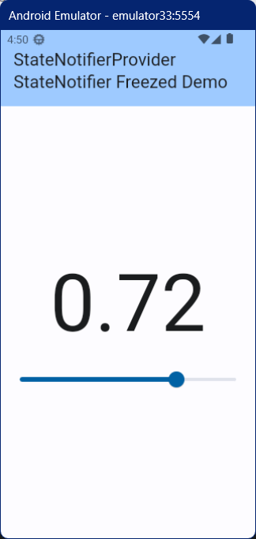

## StateNotifierProvider StateNotifier Freezed Demo

freezed で Immutable にしたインスタンスを StateNotifierProvider で扱うデモ  

### パッケージのインストール

flutter_riverpod と hooks_riverpod パッケージをインストールする

``` console
flutter pub add flutter_riverpod freezed freezed_annotation
```

``` console
flutter pub add --dev build_runner
```

### 動作イメージ

シンプルなスライダーアプリ



### ファイルの自動生成

スライダーの値を保持する MyData を freezed で作成する。

my_data.dart を作成したら、my_data.freezed.dart を作成するために、以下のコマンドを実行する。

``` console
dart run build_runner build --delete-conflicting-outputs
```

### Immutable なインスタンスを持つ StateNotifierProvider

最も単純な StateNotifierProvider は、プリミティブな値を持ったものだ。

例えば、StateNotifierProvider<MyDataStateNotifier, double>((ref) => MyDataStateNotifier()) のような形だ。

freezed を使えば、StateNotifierProvider を Immutable なインスタンスを扱う形にできる。

このデモでは、StateNotifierProvider<MyDataStateNotifier, MyData>((ref) => MyDataStateNotifier()) という形にしている。

MyData が freezed で Immutalble 化したクラスだ。

### プリミティブな値を持つ時と、オブジェクトを持つ時の値の取得方法の違い

プリミティブな値を扱う時と、オブジェクトを扱う場合は、StateNotifierProvider からの値の取得方法が異なる。

プリミティブな値を扱う StateNotifierProvider では、ref.watch(myDataProvider) と StateNotifierProvider からそのまま値を持ってくることができる。

一方、オブジェクトを扱う場合は、ref.watch(myDataProvider).sliderValue のように、オブジェクトのメンバ変数名を指定して、値を取得することになる。

### Immutable であることの確認

この簡単なデモでは、画面上の動きを見ても、値を保持するインスタンスが Immutable 化されていることは分からない。

ただし、ログを見ると、スライダー値を持つインスタンスのハッシュ値が毎回変わっていることが分かる。

すなわち、スライダーを変更するたびに、新しいインスタンスに変わっているということだ。

コンソールに表示されるログ：  
``` console
I/flutter ( 4710): sliderValue:0.17277975643382354, hashCode:127487591
I/flutter ( 4710): sliderValue:0.04776539522058824, hashCode:338672829
I/flutter ( 4710): sliderValue:0.72042144416360294, hashCode:341260646
```
